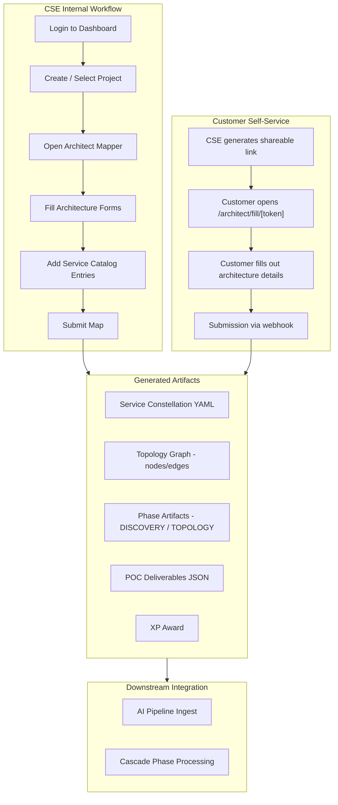
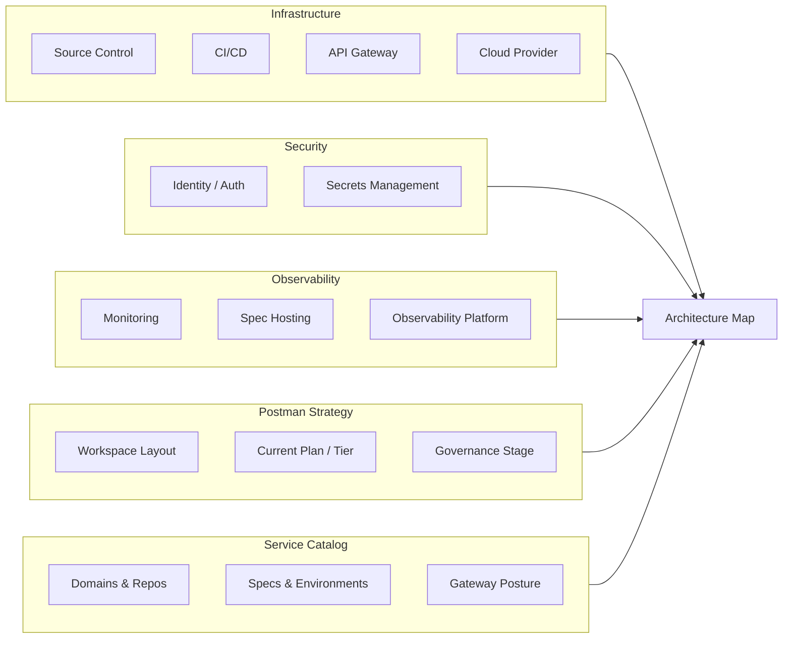

# Internal-ARCHITECT-mapper

A **Next.js 15** web application for capturing and analyzing a customer's API and platform architecture during Postman Customer Success engagements. Consultants use it to map a customer's technology landscape, generate service templates, and kick off AI-driven discovery workflows.

## Application Flow



## Architecture Capture Scope



## Features

- **Interactive Architecture Capture** — Guided forms to document source control, CI/CD, API gateways, cloud providers, identity/auth, secrets management, monitoring, spec hosting, observability, and Postman workspace strategy
- **Service Catalog Builder** — Define domains, repos, specs, environments, and catalog/gateway posture per service; generates an OpenAPI-style service constellation YAML
- **Topology Graph Generation** — Automatically builds a node/edge topology with Postman integration hints from submitted architecture data
- **Shareable Customer Links** — Generate tokenized public URLs so customers can fill out their architecture details without needing an account
- **AI Document Ingest** — Stub pipeline for chunking and labeling customer evidence documents
- **Gamification / XP Engine** — Awards experience points for engagement milestones
- **Webhook Integration** — Ingest endpoints for external architecture mapping tools and public form submissions
- **Phase Artifacts & Cascade** — Writes discovery and topology artifacts that feed into downstream pipeline phases

## Tech Stack

| Layer | Technology |
|-------|-----------|
| Framework | Next.js 15 (App Router), React 19 |
| Styling | Tailwind CSS 4 |
| Database | PostgreSQL via Prisma ORM |
| Auth | iron-session (cookie-based), bcrypt |
| Deployment | Vercel |
| Language | TypeScript |

## Getting Started

### Prerequisites

- Node.js (see `.node-version`)
- PostgreSQL database
- npm

### Setup

```bash
npm install
cp .env.example .env    # Configure database URL and session secrets
npx prisma migrate dev  # Run database migrations
npx prisma db seed      # Seed initial data
npm run dev             # Start dev server at http://localhost:3000
```

### Environment Variables

See `.env.example` for required configuration including:
- `DATABASE_URL` — PostgreSQL connection string
- `SESSION_SECRET` — Secret for cookie encryption
- `WEBHOOK_SECRET` — Bearer token for ingest webhook auth

## Project Structure

```
architecht_mapping/
├── prisma/
│   ├── schema.prisma          # Data model (projects, artifacts, topology, etc.)
│   ├── migrations/            # Database migrations
│   └── seed.ts                # Seed script
├── src/
│   ├── app/
│   │   ├── (authenticated)/   # Protected routes (dashboard, architect mapper)
│   │   ├── login/             # Login page
│   │   ├── architect/fill/    # Public tokenized form
│   │   └── api/webhooks/      # Webhook endpoints
│   ├── lib/
│   │   ├── actions/           # Server actions (auth, architect, sharing)
│   │   ├── ai/               # Document ingest & chunking
│   │   ├── cascade/          # Snapshot & impact analysis (stubbed)
│   │   └── gamification/     # XP engine & constants
│   └── middleware.ts          # Auth, security headers, rate limiting
└── vercel.json                # Deployment config
```

## Key Workflows

### Internal Use (Authenticated)
1. Log in → Dashboard → Select or create a project
2. Open the Architect Mapper → Fill out architecture details and service catalog
3. Submit → generates service template YAML, topology graph, and phase artifacts

### Customer-Facing (Public Link)
1. Generate a shareable link from the authenticated architect view
2. Customer opens the tokenized URL → fills out their architecture details
3. Submission writes back to the project via webhook

## Deployment

Deployed on **Vercel**. Push to `main` triggers automatic deployment. See `vercel.json` for route configuration.
